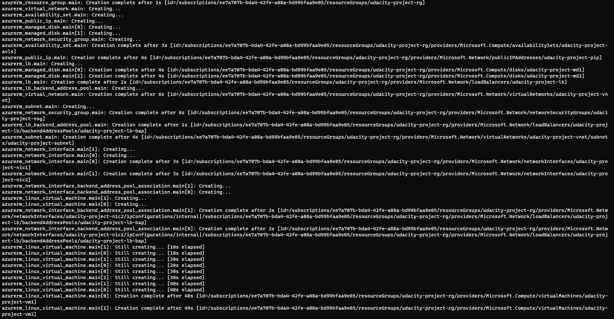

# Azure Infrastructure Operations Project: Deploying a scalable IaaS web server in Azure

### Introduction
For this project, you will write a Packer template and a Terraform template to deploy a customizable, scalable web server in Azure.
The web server you are going to create will include a virtual network connecting arbitrary number of user defined virtual machines.

### Getting Started
1. Clone this repository

2. Create your infrastructure as code

3. Update this README to reflect how someone would use your code.

### Dependencies
1. Create an [Azure Account](https://portal.azure.com) 
2. Install the [Azure command line interface](https://docs.microsoft.com/en-us/cli/azure/install-azure-cli?view=azure-cli-latest)
3. Install [Packer](https://www.packer.io/downloads)
4. Install [Terraform](https://www.terraform.io/downloads.html)

### Instructions
1. You should clone this repository to your local machine.
2. Make sure you are logged in to your Azure account in the Azure CLI.
3. Open your terminal and move to root directory of the cloned repository.
4. Run
```bash
bash getting_started.sh
```
This command will firstly create a custom policy that ensures all created resources are tagged.
You can see the created policy by running
```bash
az policy assignment list
```
The command "$bash getting_started.sh" will also deploy a packer image of a customized Virtual Machine by running
```bash
packer build project/packer/server.json
```
Deploying the packer image is going to take some time, so keep that in mind.
After the packer image has been deployed, we are going to switch to the terraform folder where we have our .tf scripts.
By running
```bash
terraform init
```
terraform will be initialized and we can continue using it with
```bash
terraform plan -out solution.plan
```
This command will save planned infrastructure to a file "solution.plan".
After the infrastructure has been validated and saved, we can deploy it by using
```bash
terraform apply "solution.plan"
```
We can see our infrastructure using the command.
```bash
terraform show
```

5. You will be asked to choose between default or user defined set of parameters for your resources.
6. If you chose default, you don't need to do anything else anymore.
7. If you didn't choose default, you will need to specify info for the resource group where your packer image will be deployed.
8. It may take a while to build your packer image.
9. Once your packer image is finished, you will need to specify info for your resources.
It is possible to edit vars.tf file to define your own default values for the resources.


### Output
If you followed all the steps, you should have 2 new resource groups on your Azure portal.
One group will have a packer image resource and the other one will have a virtual network with running virtual machines.
